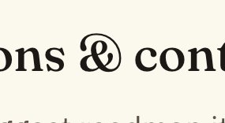

# The Cursed Ampersand Personality Archives

A field guide to ampersands with too much going on.

---

## Entry 001 — The Garden Party Aristocrat

**Location:** unknown (found in the wild, "ons & cont")
**Date spotted:** May 2026



This ampersand is *thriving*. It's got the posture of a Victorian aristocrat at a garden party, one hand on its hip, the other holding a tiny teacup it doesn't actually drink from. It's not connecting two words — it's *introducing* them at a soirée. "Have you met Contributions? Charming, really."

This is the ampersand that went to finishing school while the `&` from Arial was still learning to walk. It does not abbreviate "and." It *embellishes* it. It would be deeply offended to appear in a CSV file.

---

## Entry 002 — The Westwood Exec

**Location:** Johl & Co. Insurance, 199 Center Ave, Westwood, NJ
**Date spotted:** May 2026


This ampersand is *enormous*. It has eaten the other letters. "Johl" and "co" are cowering on either side like small children flanking their very large, very confident uncle at a wedding.

This is the ampersand that shows up to the meeting and immediately takes the head seat without asking. It doesn't connect two parties — it *acquires* them. Johl didn't start a company with Co; the ampersand showed up one day and announced they were now affiliated. Insurance, allegedly.

The little curl at the bottom is doing some kind of flourish that says "I trained in Italy." The loop at the top is one solid wink at a passing notary. Somewhere in Westwood, New Jersey, this ampersand is the most charismatic thing on the block, and it knows it.

---

## Categories under consideration

- Ampersands with too much confidence
- Ampersands that are clearly going through something
- Ampersands that should not have been allowed near a serif
- Ampersands trained in Italy (allegedly)
- Ampersands you'd trust with your money vs. ampersands you absolutely would not

---

## Submission template

```markdown
## Entry 00X — [Name]

**Location:**
**Date spotted:**


[description]

---
```
