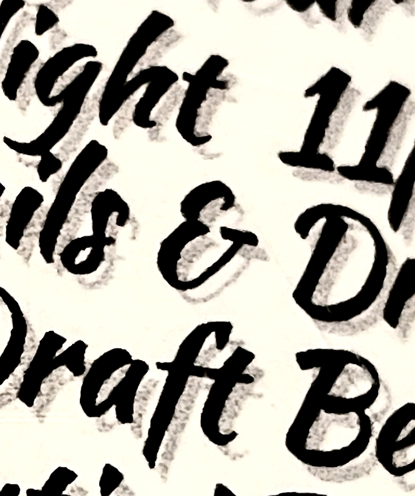
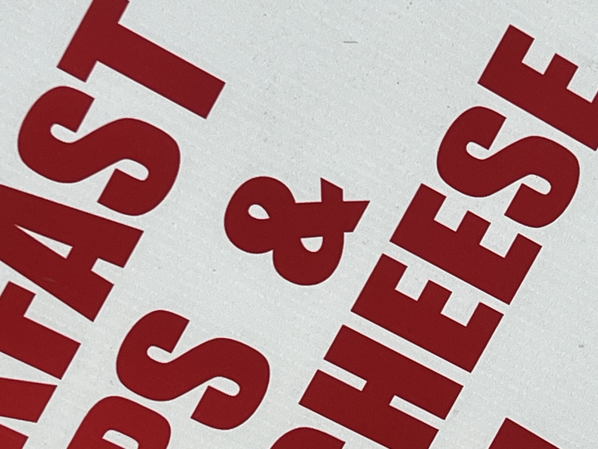

# The Cursed Ampersand Personality Archives

A field guide to ampersands with too much going on.

---

## Entry 001 — The Garden Party Aristocrat

**Location:** unknown (found in the wild, "ons & cont")
**Date spotted:** May 2026


This ampersand is *thriving*. It's got the posture of a Victorian aristocrat at a garden party, one hand on its hip, the other holding a tiny teacup it doesn't actually drink from. It's not connecting two words — it's *introducing* them at a soirée. "Have you met Contributions? Charming, really."

This is the ampersand that went to finishing school while the `&` from Arial was still learning to walk. It does not abbreviate "and." It *embellishes* it. It would be deeply offended to appear in a CSV file.

---

## Entry 002 — The Westwood Exec

**Location:** Johl & Co. Insurance, 199 Center Ave, Westwood, NJ
**Date spotted:** May 2026


This ampersand is *enormous*. It has eaten the other letters. "Johl" and "co" are cowering on either side like small children flanking their very large, very confident uncle at a wedding.

This is the ampersand that shows up to the meeting and immediately takes the head seat without asking. It doesn't connect two parties — it *acquires* them. Johl didn't start a company with Co; the ampersand showed up one day and announced they were now affiliated. Insurance, allegedly.

The little curl at the bottom is doing some kind of flourish that says "I trained in Italy." The loop at the top is one solid wink at a passing notary. Somewhere in Westwood, New Jersey, this ampersand is the most charismatic thing on the block, and it knows it.

---

## Entry 003 — The Maître d' Between Shifts

**Location:** TBD
**Date spotted:** May 2026



This ampersand is bowing. Not metaphorically — it has physically folded itself at the waist to greet you. Brush-script, tilted forward, one arm tucked behind its back, the other gesturing toward an empty table that may or may not exist. "Right this way, sir."

This is the ampersand that has been a maître d' at the same restaurant for thirty-one years and has personally seated four mayors, two senators, and one woman he is fairly sure was Joan Didion. He will not confirm. He does not gossip. He simply remembers.

On his break he writes poetry in a small leather notebook he bought in Lisbon. Nobody knows about the poetry. Nobody will. The serif at the top is the corner of his pocket square. The flourish at the bottom is the heel of his shoe lifting slightly off the floor as he pivots. He has not been surprised by anything since 1994.

---

## Entry 004 — The Star-Spangled Acquirer

**Location:** TBD (likely a deli or bodega — "Breakfast something & Cheese," presumably)
**Date spotted:** May 2026



This ampersand is *red*. Fire-engine, flag-on-the-Fourth, hand-on-heart red. It is bold, it is sans-serif, it is approximately the same size as the letters around it but radiates the energy of being three sizes larger. There is no flourish. There is no nuance. There is one (1) job and it is being done.

This is the ampersand that owns a slightly weathered American flag and flies it year-round. It calls everyone "chief." It has strong opinions about the proper temperature for coffee and the proper way to fold a deli sandwich, and it will share both unprompted. It has never once doubted itself, on any topic, ever.

The little crossbar at the base is planted like a flagpole in concrete. The two loops are clenched fists. Bald eagle screech somewhere in the middle distance. This ampersand does not connect Breakfast and Cheese — it *vouches* for them, personally, and would step in front of a bus for either one.

---

## Categories under consideration

- Ampersands with too much confidence
- Ampersands that are clearly going through something
- Ampersands that should not have been allowed near a serif
- Ampersands trained in Italy (allegedly)
- Ampersands you'd trust with your money vs. ampersands you absolutely would not

---

## Submission template

```markdown
## Entry 00X — [Name]

**Location:**
**Date spotted:**


[description]

---
```
